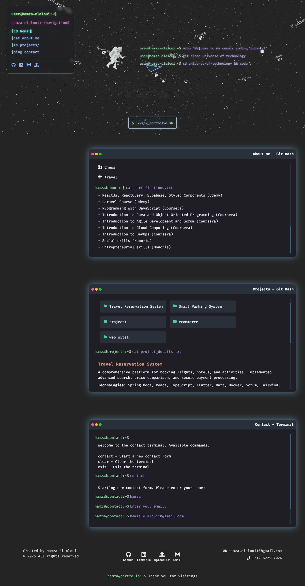

# 🚀 Hamza El Aloui's Cosmic Portfolio 🌌  

Welcome to **"Universe of Technologies"** – a futuristic and interactive **3D portfolio** that blends the aesthetics of a **Linux terminal** with a **cosmic digital experience**. Built with **React, Three.js, and Styled Components**, this project showcases my skills, projects, and contact details in a uniquely immersive way.  

  

## 🔗 Live Demo  
🌍 **[Explore the Universe](https://hamza-el-aloui.vercel.app/)**  

## 🎨 Concept & Design  
This portfolio redefines the traditional resume by offering:  
- **🚀 3D Cosmic Navigation** – Explore technologies as if they were celestial bodies in a vast digital space.  
- **🖥️ Terminal-Inspired Interface** – Navigate my skills, projects, and contact details like a Linux terminal.  
- **🎭 Smooth Animations** – Seamless and interactive transitions for a futuristic experience.  

## 🛠️ Tech Stack  
- **Frontend**: React, React Three Fiber, Styled Components  
- **3D Graphics**: Three.js  
- **Animations**: Framer Motion  
- **Deployment**: Vercel  

## 📂 Features  
✔️ **3D space environment** with interactive elements  
✔️ **Linux-style terminal navigation**  
✔️ **Animated project showcase**  
✔️ **Terminal-based contact form**  
✔️ **Responsive & optimized performance**  

## 🚀 Installation & Usage  

Clone the repository:  
```bash
git clone https://github.com/your-username/your-repo.git
cd your-repo
